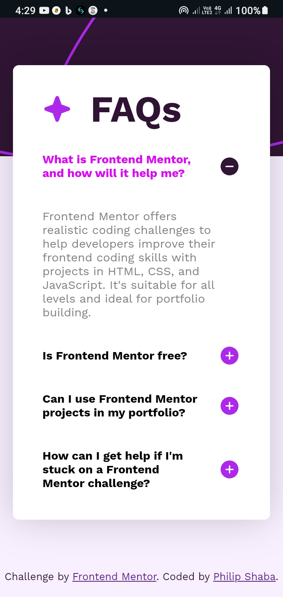

# Frontend Mentor - FAQ accordion solution

This is a solution to the [FAQ accordion challenge on Frontend Mentor](https://www.frontendmentor.io/challenges/faq-accordion-wyfFdeBwBz). Frontend Mentor challenges help you improve your coding skills by building realistic projects. 

## Table of contents

- [Overview](#overview)
  - [The challenge](#the-challenge)
  - [Screenshot](#screenshot)
  - [Links](#links)
- [My process](#my-process)
  - [Built with](#built-with)
  - [What I learned](#what-i-learned)
  - [Continued development](#continued-development)
  - [Useful resources](#useful-resources)
- [Author](#author)
- [Acknowledgments](#acknowledgments)

## Overview

### The challenge

Users should be able to:

- Hide/Show the answer to a question when the question is clicked
- Navigate the questions and hide/show answers using keyboard navigation alone
- View the optimal layout for the interface depending on their device's screen size
- See hover and focus states for all interactive elements on the page

### Screenshot

                                                      Desktop view


                                                      Mobile view



### Links

- [Solution URL](https://github.com/SHABA01/faq-frontend)
- [Live Site URL](https://shaba01.github.io/faq-frontend)

## My process

### Built with

- Semantic HTML5 markup
- CSS custom properties
- Flexbox
- CSS Grid
- Mobile-first workflow
- Vanilla JavaScript

### What I learnt

One of the key things I learnt from this project was the effective use of individual click event listeners which were attached to each `.faq-question-container`. This approach works fine for a small number of elements, but it may become less efficient as the number of elements increases.

```javascript
var faqQuestionContainers = document.querySelectorAll('.faq-question-container');

    faqQuestionContainers.forEach(function (container, index) {
        var iconPlus = container.querySelector('.icon-plus');
        var iconMinus = container.querySelector('.icon-minus');
        var faqAnswer = container.querySelector('.faq-answer');

        container.addEventListener('click', function () {
            toggleAnswerState();
        });

        // Toggle visibility of icons and answer based on the state
        function toggleAnswerState() {
            if (faqAnswer.style.display === 'none' || getComputedStyle(faqAnswer).getPropertyValue('display') === 'none') {
                // Expand the question
                iconPlus.style.display = 'none';
                iconMinus.style.display = 'inline-block';
            } else {
                // Collapse the question
                iconPlus.style.display = 'inline-block';
                iconMinus.style.display = 'none';
            }

            // Toggle the active class on the container
            container.classList.toggle('active');
        }
```

 A more efficient method would be to use event delegation for handling click events on multiple FAQ question containers. This approach improves performance, especially when dealing with a larger number of elements.

```javascript
var faqContainerBody = document.querySelector('.faq-container-body');

faqContainerBody.addEventListener('click', function (event) {
    var container = event.target.closest('.faq-question-container');
    if (container) {
        toggleAnswerState(container);
    }
});
```

### Continued development

I plan to continue improving my skills in accessibility, ensuring that the accordion is usable and navigable for all users. Additionally, I aim to explore more advanced CSS techniques for creating responsive and visually appealing interfaces.

### Useful resources

- [MDN Web Docs](https://developer.mozilla.org/en-US) - This comprehensive resource for HTML, CSS, and JavaScript documentation helped me to understand the relationship between linked files and how to reference elements across each file.

## Author

- LinkedIn - [Philip Shaba](https://www.linkedin.com/in/philip-shaba-0879a5150)
- Frontend Mentor - [@SHABA01](https://www.frontendmentor.io/profile/SHABA01)
- X - [@ShabaPhilip1](https://www.twitter.com/ShabaPhilip1)

## Acknowledgments

I would like to acknowledge the Frontend Mentor community for providing this challenge and the resources that helped me enhance my skills during this project.